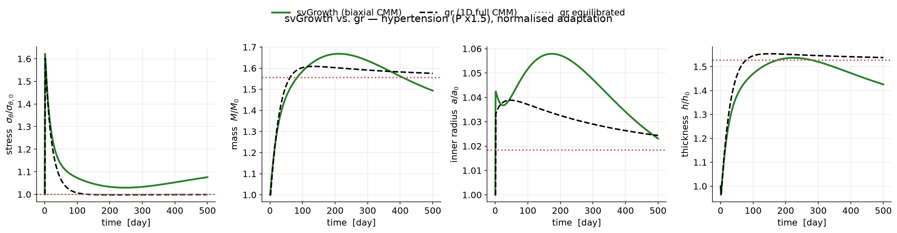

# Cross-validation against svGrowth

This branch reproduces the **hypertension** exercise using
[**svGrowth**](https://github.com/StanfordCBCL/svGrowth) — a full,
research-grade constrained-mixture G&R framework — and checks that its results
agree with the teaching code in `gr`.

> **Why only hypertension?** svGrowth's perturbations act on pressure, flow, and
> axial stretch, but there is no mechanism to *degrade a constituent's mass*, so
> the **aneurysm (elastin-loss)** scenario cannot be run without extending
> svGrowth. The stability capstone likewise depends on elastin loss. Those stay
> `gr`-only; hypertension is the scenario both codes can run.

---

## What is being compared

`gr` is a deliberately reduced **1D, single-stress (circumferential)** model.
svGrowth is a **biaxial thin-walled cylinder** with a full 3×3 stress state,
wall-shear-stress feedback, and (optionally) active tone. They are *different
models*, so an exact numerical match is neither expected nor the goal. Instead we
configure svGrowth to solve the same constrained-mixture problem as closely as
its formulation allows, drive both with the same **+50% pressure step**, and
compare **normalised** trajectories `q(t)/q(0)` — the *relative* adaptation.

### How the models are matched (`build_config.py`)

`gr.Model` is the single source of truth; `build_config.py` emits the matching
svGrowth YAML:

| Ingredient | Match |
|---|---|
| constituents, mass fractions, deposition stretches | identical to `gr` |
| collagen & SMC (Fung fibers, circumferential) | svGrowth's Fung Cauchy stress **equals `gr`'s exactly** — verified: σ_h = 60.6 / 135.9 kPa in both |
| production | linear, intramural-stress gain = `gr`'s `gain`, ∝ current mass — same law as `gr` |
| degradation | **constant** `k_α = k_d` (svGrowth's stress-dependent term switched off) |
| survival | exponential — same as `gr` |
| elastin | no turnover, as in `gr` |
| active smooth-muscle tone | **off** (extra physics `gr` omits) |
| wall shear stress | **on, at constant flow** — see below |

### Two subtleties that make the comparison fair

1. **Homeostatic pressure is calibrated.** svGrowth's elastin (a 3-D neo-Hookean,
   `S = c·I`) is stiffer than `gr`'s 1-D form, so at the shared deposition
   stretches svGrowth's homeostatic mixture stress is 114.6 kPa vs `gr`'s
   102.4 kPa. `run_svgrowth.py` therefore calibrates `P_h` so that `t = 0` is a
   true equilibrium (verified: a flat no-insult baseline). Because we compare
   normalised quantities, this constant offset does not matter.

2. **WSS regulates the lumen.** `gr`'s 1-D thin wall has *no independent lumen
   degree of freedom* — its radius is tied to the circumferential stretch and
   returns to the reference value. svGrowth carries radius and thickness as
   independent unknowns, so it needs the physiological **wall-shear-stress
   feedback (at constant flow)** to hold the lumen — the direct analog of `gr`'s
   fixed reference radius. With WSS *off*, svGrowth's radius drifts by ~30% and
   the stress never recovers; with it *on*, the radius returns to within 0.1% of
   `gr`. (This is itself a nice illustration of what the 1-D reduction hides.)

---

## Results



Normalised adaptation to a +50% pressure step (500 days). Both independent codes
spike, then relax back toward homeostasis and settle near the `gr` equilibrated
targets (dotted). Agreement at the end of the run:

| quantity | svGrowth | gr full CMM | difference |
|---|---|---|---|
| inner radius `a/a₀` | 1.023 | 1.024 | **0.1%** |
| mass `M/M₀` | 1.493 | 1.575 | 5.5% |
| stress `σθ/σθ₀` | 1.076 | 0.999 | 7.2% |
| thickness `h/h₀` | 1.426 | 1.538 | 7.9% |

The radius — regulated by the WSS feedback — matches to well under 1%. The
remaining few-percent residuals come from (i) svGrowth's stress **still
converging** at 500 days (σθ is at 1.076 and falling toward 1; svGrowth's coupled
WSS/intramural dynamics relax more slowly than `gr`'s), and (ii) the **elastin**
constitutive form differing between the biaxial and 1-D reductions. Given two
independently written codes of different dimensionality, agreement at this level
is a strong cross-validation of the shared mechanobiology — in particular, the
intramural-stress → wall-thickening mechanism that is the heart of the lecture.

---

## Reproducing it

svGrowth needs an older scientific stack (numba → NumPy < 2.4, Python < 3.14)
than `gr`, so it runs in its **own** virtual environment and is driven as a
subprocess.

```bash
# 1. one-time: create the svGrowth environment (from the repo root)
bash comparison/setup_svgrowth_env.sh          # creates .venv-svgrowth

# 2. run svGrowth and cache its output (the slow, O(N^2) part, ~3 min)
uv run python comparison/run_svgrowth.py --n-days 500 --dt 1.0 --pressure-factor 1.5
#    -> comparison/data/svgrowth_hypertension.csv  (committed, so you can skip this)

# 3. compare against gr and regenerate the figure (fast)
uv run python comparison/compare.py
#    -> docs/figures/fig_svgrowth_comparison.pdf (+ .png), prints the table above
```

Point `run_svgrowth.py` at a different svGrowth checkout or interpreter with the
`SVGROWTH_DIR` and `SVGROWTH_PYTHON` environment variables.

## Files

| File | Role |
|---|---|
| `build_config.py` | builds the matched svGrowth YAML from `gr.Model` |
| `run_svgrowth.py` | calibrates `P_h`, runs svGrowth (own venv), caches the CSV |
| `compare.py` | overlays svGrowth vs `gr`, prints the agreement table, makes the figure |
| `data/svgrowth_hypertension.csv` | cached svGrowth output (committed) |
| `setup_svgrowth_env.sh` | one-time creation of `.venv-svgrowth` |
