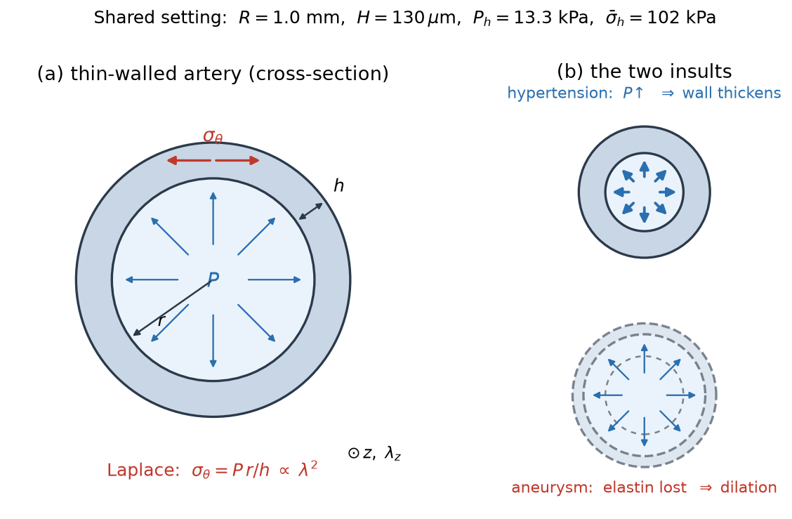

# Lecture notes — overview

These notes accompany the code in this repository. Read them in order; each ends
with a pointer to a short hands-on exercise.

1. [Biology](01_biology.md) — why tissues grow and remodel (no maths).
2. [Finite-strain fundamentals](02_finite_strain.md) — stretch, stress,
   constituent laws, the deposition stretch, multiplicative decomposition.
3. [Kinematic growth](03_kinematic_growth.md) — theory 1 of 4.
4. [Constrained mixture (full)](04_constrained_mixture.md) — theory 2 of 4, the
   heart of the lecture.
5. [Homogenized CMM](05_homogenized_cmm.md) — theory 3 of 4.
6. [Equilibrated CMM](06_equilibrated_cmm.md) — theory 4 of 4.
7. [Stability capstone](07_stability.md) — adaptation vs. aneurysm; the payoff.

## The four theories at a glance

| # | Theory | Core object | Cost | Predicts stability? |
|---|---|---|---|---|
| 1 | Kinematic growth | growth stretch $\theta$ | cheap | no (imposes a set-point) |
| 2 | Full CMM | heredity integrals over cohorts | $O(N^2)$ | yes (reference) |
| 3 | Homogenized CMM | 2 ODEs per constituent | $O(N)$ | yes |
| 4 | Equilibrated CMM | one algebraic equation | instant | yes — existence ⇔ stability |

## The shared setting

Everything runs on one shared parameter set
([`gr/parameters.py`](../src/gr/parameters.py)) and one geometry
([`gr/geometry.py`](../src/gr/geometry.py)):

- a **thin-walled artery** (required stress $\propto \lambda^2$, Laplace).

That quadratic Laplace exponent is what lets the artery become unstable: dilation
raises the wall stress faster than growth can thicken the wall away. Two insults
drive the tissue: **hypertension** (a pressure step) and **aneurysm** (elastin
loss).

All figures in these notes are generated by the scripts in
[`solutions/`](../solutions); regenerate them with
`uv run python solutions/make_all_figures.py`. Each simulation figure also has an
animated twin (deforming vessel + insult + live curves) — see
[`docs/videos/`](videos/README.md), built by
`uv run python solutions/make_all_videos.py`.
