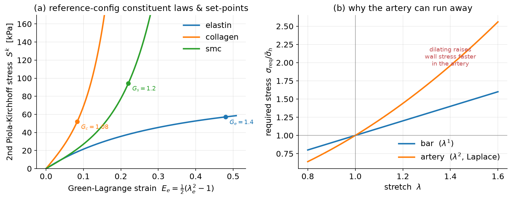

# 2. Finite-strain fundamentals (the minimum you need)

*Goal: just enough continuum mechanics to read the four theories. If you have
seen finite strain before, skim to §2.4.*

---

## 2.1 Deformation and stretch

A body deforms from a **reference** configuration to a **current** one. The
deformation gradient $\mathbf{F}$ maps reference line elements to current ones.
Everything in this course collapses to a single dominant direction (the bar's
axis, or the artery's circumference), so we work with one scalar **stretch**

$$\lambda = \frac{\text{current length}}{\text{reference length}}.$$

$\lambda = 1$ is undeformed; $\lambda > 1$ is extension.

We assume the tissue is **incompressible** (it neither gains nor loses volume
elastically — only *growth* changes volume). That lets us recover the through-
thickness and transverse stretches from $\lambda$ alone, which is why one number
suffices.

**Strain lives in the reference configuration.** Throughout this course we
measure strain with the (reference-configuration) **Green–Lagrange strain**,

$$E = \tfrac{1}{2}\!\left(\lambda^2 - 1\right) = \tfrac{1}{2}(C-1),\qquad C = \lambda^2,$$

where $C = \mathbf{F}^{\!\top}\mathbf{F}$ is the right Cauchy–Green deformation
(here a scalar). $E=0$ in the undeformed reference state. Green–Lagrange strain
is the natural partner of the reference stress measure introduced next; anchoring
both to the reference configuration is what keeps the growth-and-remodeling
kinematics consistent.

## 2.2 Stress measures — and which configuration each lives in

Finite strain offers three stress measures; keeping them straight is the whole
point of this section.

| measure | symbol | referred to | definition |
|---|---|---|---|
| **2nd Piola–Kirchhoff** | $S$ | **reference** config | $S=\partial W/\partial E_e$ (work-conjugate to $E_e$) |
| Cauchy (true) | $\sigma$ | current config | $\sigma=\lambda_e^2\,S$ (force / current area; $J=1$) |

(The nominal, or 1st Piola–Kirchhoff, stress $\lambda_e S$ — force in the current
configuration per *reference* area — sits between the two; the code exposes it as
`stress_pk1`, but $S$ and $\sigma$ are the only two we use throughout.)

The **constitutive law lives in the reference configuration**: a constituent's
response is $S=\partial W/\partial E$, both referential. We only *push forward* to
the Cauchy stress $\sigma=\lambda_e^2 S$ where a genuinely spatial balance demands
it — namely the Laplace law for the pressurised artery,

$$\sigma_\theta = \frac{P\,r}{h}\qquad\text{(circumferential wall stress, current config)},$$

with luminal pressure $P$, current inner radius $r$, wall thickness $h$.
Equilibrium is intrinsically a *spatial* statement, so Cauchy stress appears
there; everywhere else (the material laws, the deposition
set-points, the stress power) we stay in the reference configuration.

The two settings, their boundary conditions, and the two insults are shown below.
The bar is loaded by a **dead axial load** $f$ (fixed at one end), so its required
stress grows like $\lambda^1$; the artery is loaded by **internal pressure** $P$,
so by Laplace its wall stress grows like $\lambda^2$. That single difference in
exponent is what makes the artery — but not the bar — able to lose stability
([§7](07_stability.md)).

*(a) The 1-D tissue bar under a dead load. (b) The thin-walled artery
cross-section: internal pressure $P$ (blue), circumferential wall stress
$\sigma_\theta$ (red), inner radius $r$, thickness $h$, balanced by Laplace. (c)
The two insults — hypertension raises $P$ (wall thickens); aneurysm degrades
elastin (the wall dilates, dashed = original size).*

## 2.3 Hyperelastic constituents (in reference measures)

Each constituent stores energy $W$ **per unit reference volume**; its
reference-configuration stress is the derivative $S=\partial W/\partial E$
(equivalently $S=\tfrac{1}{\lambda_e}\,\mathrm{d}W/\mathrm{d}\lambda_e$). We use
the two laws standard for arterial tissue — the same free energies as the
constrained-mixture literature (e.g. the FSGe formulation), implemented in
[`gr/mechanics.py`](../src/gr/mechanics.py):

**Elastin — neo-Hookean** (soft, barely stiffening; a rubber), $I_1 = \lambda_e^2 + 2/\lambda_e$:

$$W_e = \tfrac{c_e}{2}(I_1 - 3),\qquad
  S_e(\lambda_e) = c_e\!\left(1 - \lambda_e^{-3}\right).$$

**Collagen & smooth muscle — Fung exponential fiber** (crimped, then stiffens
steeply once recruited), $I_4 = \lambda_e^2$:

$$W = \frac{c_1}{4c_2}\Big(e^{\,c_2 (I_4-1)^2} - 1\Big),\qquad
  S(\lambda_e) = c_1\,(\lambda_e^2-1)\,e^{\,c_2(\lambda_e^2-1)^2}.$$

The Cauchy stress used in the spatial balance is then the push-forward
$\sigma = \lambda_e^2\,S$ — for elastin
$\sigma_e = c_e(\lambda_e^2 - 1/\lambda_e)$, and for the Fung fiber
$\sigma = c_1\lambda_e^2(\lambda_e^2-1)e^{c_2(\lambda_e^2-1)^2}$.

*Left: the constituent laws in **reference measures** — 2nd Piola–Kirchhoff
stress $S^k$ vs Green–Lagrange strain $E_e$ — with the deposition set-points
$(E_e(G^k),\,S^k(G^k))$ marked. Elastin is soft; collagen and muscle stiffen
steeply (their curves run off-scale past the physiological window). Right: the
"required stress" the loading demands, a **spatial (Cauchy)** balance — linear
for the bar, **quadratic for the artery** (Laplace). That extra power of
$\lambda$ is the whole story of arterial instability (§7).*

## 2.4 The deposition stretch $G^k$ (the crucial modelling idea)

Cells deposit new fibers **already under tension**, at a fixed **deposition
stretch** $G^k > 1$ (see [biology §1.3](01_biology.md)). So at homeostasis a
constituent's elastic stretch equals its own $G^k$ (referentially,
$E_e = \tfrac{1}{2}(G_k^2-1)$), and we *define* its homeostatic stress from that:

$$\boxed{\;\sigma_h^k := \sigma^k(G^k) = G_k^2\,S^k(G^k)\;}\tag{2.1}$$

This one convention (coded in [`gr/parameters.py`](../src/gr/parameters.py)) pins
down every set-point in the course from a few physical inputs, and is why all
four theories can share parameters.

> **Notation for §§3–7.** From here on, $\sigma$ (a constituent) and
> $\bar\sigma$ (the mixture) denote the **Cauchy / intramural** stress — the
> push-forward $\sigma=\lambda_e^2 S$ that enters the spatial equilibrium and the
> mechano-sensing that drives growth. The material response and strains behind
> them remain the reference-configuration $S(E)$ of §2.2–2.3; only mass balance
> and the load balance are stated spatially, exactly as they must be.

## 2.5 Multiplicative decomposition — growth vs. elasticity

The single most important kinematic idea in G&R: split the deformation into a
stress-free **inelastic** part (growth/remodeling) and an **elastic** part (the
only part that carries stress). In 1D,

$$\lambda = \lambda_e \,\lambda_{\text{inel}}.\tag{2.2}$$

- **Kinematic growth** ([§3](03_kinematic_growth.md)) uses one such split with an
  inelastic *growth* stretch.
- **Constrained mixtures** ([§4](04_constrained_mixture.md)) give *each cohort of
  each constituent* its own inelastic natural configuration and superpose them.

Equation (2.2) and the set-point (2.1) are the two pieces of machinery you will
see reused in every model. Next: [kinematic growth](03_kinematic_growth.md).
