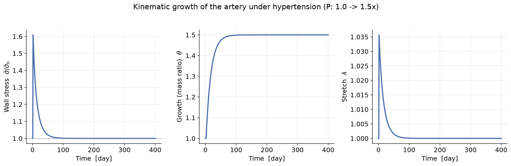

# 3. Kinematic growth theory

*Rodriguez, Hoger & McCulloch (1994). Code:
[`gr/kinematic_growth.py`](../src/gr/kinematic_growth.py).*

---

## 3.1 The idea in one line

Postulate a stress-free **growth** deformation that drives the tissue stress back
to a prescribed set-point. Growth is a change of the *natural volume*; elasticity
is what is left over to satisfy the loads.

## 3.2 Kinematics

Split the deformation (2.2) into elastic and growth parts:

$$\mathbf{F} = \mathbf{F}_e\mathbf{F}_g .$$

Only $\mathbf{F}_e$ stores energy. For an artery, growth is **radial wall
thickening**: the wall grows through its thickness (adding material) without
changing the circumferential elastic stretch. We capture this with a single
scalar thickening variable $\theta$ (a transversely isotropic growth tensor
$\mathbf{F}_g = \mathbf{I} + (\theta-1)\mathbf{e}_r\otimes\mathbf{e}_r$), so

$$\frac{M}{M_0} = \theta,\qquad \text{constituent elastic stretch} = G^k\lambda,$$

with $\lambda$ the circumferential tissue stretch. At homeostasis
$\theta=1,\ \lambda=1$ and every constituent sits at $G^k$, giving $\sigma_h^k$.

The whole mixture shares **one** growth variable: there is no individual
constituent turnover, and no remodeling of natural configurations. That
simplicity is kinematic growth's strength and its ceiling.

## 3.3 Growth law

Growth is driven to null the tissue-stress deviation from the set-point (a
first-order form of the classic stress-dependent growth law; production taken
proportional to current mass):

$$\frac{\mathrm{d}\theta}{\mathrm{d}t}
   = k_g\theta\left(\frac{\bar\sigma}{\bar\sigma_h}-1\right).\qquad (3.1)$$

At each instant $\theta$ is known and the current stretch $\lambda$ follows from
mechanical equilibrium $\bar\sigma(\lambda)=\sigma_{\text{req}}(\lambda,\theta)$
([`gr/geometry.py`](../src/gr/geometry.py)).

## 3.4 Stability — the defining feature

The set-point $\bar\sigma_h$ is **prescribed**: wherever growth stops
($\dot\theta=0$), the stress is homeostatic *by construction*. So kinematic
growth has exactly two possible fates:

- **converge** to the prescribed homeostatic stress, or
- **run away** without bound.

Which one occurs is decided by the sign of the mechanical feedback. Linearising
(3.1) about a fixed point $\theta^\ast$, growth is stable iff adding mass *lowers*
the stress it must carry:

$$\left.\frac{\mathrm{d}\bar\sigma}{\mathrm{d}\theta}\right|_{\theta^\ast} < 0 .$$

For the **artery** (required stress $\propto\lambda^2$, Laplace) this holds while
the insult is mild, so growth is self-limiting; a strong enough insult flips the
sign and growth runs away. But note: kinematic growth can only *impose* a
set-point; it cannot *predict* mechanobiological stability from tissue turnover.
That is what the mixture theories add
([§4](04_constrained_mixture.md)–[§7](07_stability.md)).

*Kinematic growth of the artery adapting to a step rise in pressure (1 → 1.5×):
it restores the prescribed homeostatic stress by thickening the wall. The stress
returns exactly to the set-point — that is guaranteed here, not predicted.*

---

### Exercise → [`exercises/ex01_kinematic_growth.py`](../exercises/ex01_kinematic_growth.py)

Change the growth-rate gain $k_g$ and the pressure step, and watch how fast (and
whether) the tissue returns to homeostasis. Push the pressure high enough to
trigger runaway.
