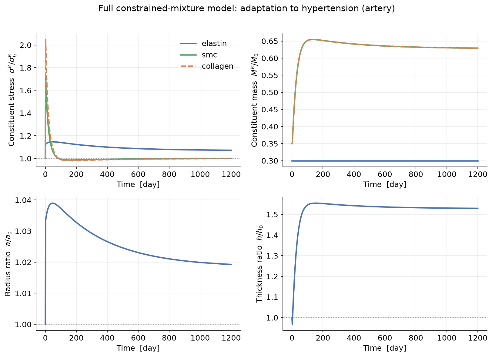

# 4. The (full) constrained mixture model

*Humphrey & Rajagopal (2002); Baek, Valentín & Humphrey; Latorre & Humphrey.
Code: [`gr/constrained_mixture.py`](../src/gr/constrained_mixture.py). This is the
heart of the lecture.*

---

## 4.1 The idea

Model the tissue as a **mixture of constituents** (elastin, collagen, smooth
muscle) that are **constrained to deform together** but each carries its **own
natural configuration** and is continuously **produced and removed**. Because
material is deposited at different times — under different loads — the tissue
carries a whole *history* of cohorts. Tracking that history is what makes this
model faithful, and expensive.

## 4.2 Mass balance — the heredity integral

The mass of a turnover constituent $k$ present now is the surviving remnant of
what was there initially plus everything produced since, each aged by a survival
function:

$$M^k(t) = M^k(0)\,q^k(t,0) + \int_0^t m^k(\tau)\,q^k(t,\tau)\,\mathrm{d}\tau.\tag{4.1}$$

- **Survival** (first-order/Poisson removal at rate $k_d^k$):
  $$q^k(t,\tau) = e^{-k_d^k (t-\tau)}.\tag{4.2}$$
  The mean lifetime is $1/k_d^k$ (weeks–months for collagen/muscle; **elastin
  does not turn over**, $k_d^e = 0$).

- **Production** — proportional to current mass, modulated by a stress stimulus
  that vanishes at homeostasis. We drive it by the **tissue** (mixture) stress,
  so all constituents grow together to restore tissue homeostasis:
  $$m^k(\tau) = k_d^k\,M^k(\tau)\,\Upsilon(\tau),\qquad
    \Upsilon(\tau) = 1 + K_\sigma^k\!\left(\frac{\bar\sigma(\tau)}{\bar\sigma_h}-1\right).\tag{4.3}$$

## 4.3 Each cohort remembers its birth configuration

A cohort of $k$ deposited at time $\tau$ is laid down at the deposition stretch
$G^k$. As the tissue goes on deforming, that cohort stretches *with* the mixture,
so its elastic stretch evaluated now is

$$\lambda_e^{k}(t;\tau) = G^k\,\frac{\lambda(t)}{\lambda(\tau)}.\tag{4.4}$$

At birth ($t=\tau$) it sits exactly at $G^k$ (hence $\sigma_h^k$). This is the
**constrained-mixture constraint**: every constituent shares the current
deformation, but each cohort measures it from a different starting point.

## 4.4 Mixture stress = history integral

The mixture Cauchy stress is the **referential-mass**-weighted sum over **all**
surviving cohorts of their constituent stresses — each computed referentially as
$S^k$ and pushed forward, $\sigma^k=\lambda_e^2 S^k$ (rule of mixtures):

$$\bar\sigma(t) = \frac{1}{M_{\text{tot}}}\sum_k\left[
   M^k(0)\,q^k(t,0)\,\sigma^k\!\big(G^k\lambda(t)\big)
   + \int_0^t m^k(\tau)\,q^k(t,\tau)\,\sigma^k\!\Big(G^k\tfrac{\lambda(t)}{\lambda(\tau)}\Big)\mathrm{d}\tau\right].\tag{4.5}$$

At each time step the code discretises (4.1) and (4.5) as sums over stored
cohorts, then solves (4.5) $=\sigma_{\text{req}}(\lambda)$ for the current
stretch. Elastin contributes a single, non-renewing cohort (optionally degraded
by an insult).

> **Numerical note.** With exponential survival the exact per-step cohort weight
> is $\big(e^{k_d\,\Delta t}-1\big)/k_d$, not simply $\Delta t$. Using the exact
> weight makes the discrete steady state land *exactly* on $\bar\sigma_h$ (no
> $O(k_d\Delta t)$ bias) — that is why the code uses it, and why the full CMM,
> homogenized, and equilibrated results coincide to several digits.

## 4.5 What it buys you: stability is *predicted*

Unlike kinematic growth, nothing here prescribes the outcome. Whether the tissue
adapts or dilates without bound **emerges** from the turnover dynamics and the
insult. Under hypertension the model grows collagen and muscle while elastin is
merely diluted, and the stress returns to homeostatic:

*The turnover story, panel-for-panel with the video. (a) Collagen and smooth
muscle remodel their stress back to their own homeostatic set-point
$\sigma_h^k$, while elastin — which cannot turn over — stays elevated (collagen
is dashed, drawn on top). (b) Collagen and muscle grow in mass; elastin is
merely diluted. (c) The mid-wall radius barely changes while (d) the wall
thickens — textbook hypertensive adaptation.*

The price is cost: the history integrals make the model $O(N^2)$ in the number of
time steps. That is precisely the motivation for the **homogenized** model
([§5](05_homogenized_cmm.md)), which reproduces this behaviour with two ODEs.

---

### Exercise → [`exercises/ex03_constrained_mixture.py`](../exercises/ex03_constrained_mixture.py)

Change the turnover time $1/k_d$ and the gain $K_\sigma$, and watch how quickly
the wall adapts. Then degrade elastin (the aneurysm insult) and see collagen take
over the load.
