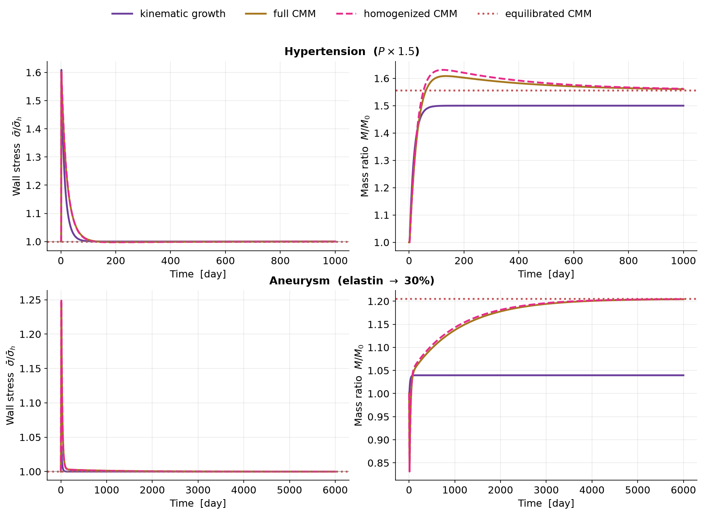

# 5. The homogenized constrained mixture model

*Cyron, Aydin & Humphrey (2016); Braeu, Seitz, Aydin & Cyron (2017). Code:
[`gr/homogenized_cmm.py`](../src/gr/homogenized_cmm.py).*

---

## 5.1 The idea: throw away the history, keep its average

The full model ([§4](04_constrained_mixture.md)) stores every cohort. Most of
that detail is redundant: at any moment the surviving cohorts of a constituent
look alike. **Temporal homogenization** replaces the entire deposition history of
a constituent by a *single evolving mean natural configuration*. The heredity
integral becomes two ordinary differential equations per constituent, and the
cost drops from $O(N^2)$ to $O(N)$.

## 5.2 State and elastic stretch

For each turnover constituent we evolve its mass $M^k$ and a **mean natural
stretch** $\lambda_n^k$. Its elastic stretch is

$$\lambda_e^k = \frac{\lambda}{\lambda_n^k}.\qquad (5.1)$$

## 5.3 Growth (mass)

Mass production is proportional to current mass and driven by the tissue-stress
deviation — the Cyron–Braeu growth law $\dot\rho = \rho k_\sigma(\sigma-\sigma_h)/\sigma_h$:

$$\frac{\mathrm{d}M^k}{\mathrm{d}t}
   = M^k(K_\sigma^k k_d^k)\left(\frac{\bar\sigma}{\bar\sigma_h}-1\right).\qquad (5.2)$$

Because production scales with current mass, the fixed point $\dot M^k=0$ is
$\bar\sigma=\bar\sigma_h$ for **any** mass — so mass is free to settle wherever it
must to restore tissue stress.

## 5.4 Remodeling (natural configuration)

New mass is deposited at the deposition stretch $G^k$ (i.e. with mean natural
stretch $\lambda/G^k$); old mass, at the current $\lambda_n^k$, is removed.
Mixing the two at the turnover rate gives

$$\frac{\mathrm{d}\lambda_n^k}{\mathrm{d}t}
   = \frac{m^k}{M^k}\left(\frac{\lambda}{G^k}-\lambda_n^k\right),\qquad
   m^k = k_d^k M^k \Upsilon^k.\qquad (5.3)$$

This is the temporal homogenization of the cohort relation (4.4). Holding
$\lambda$ fixed, (5.3) makes the constituent stress **relax exponentially toward
its homeostatic value** $\sigma_h^k$ with a time constant $\sim 1/k_d$ — exactly
Cyron 2016's **mechanical analog**: a Maxwell spring–dashpot in parallel with a
"motor" that holds the homeostatic prestress. At steady state
$\lambda_n^k\to\lambda/G^k$, so $\lambda_e^k\to G^k$ and
$\sigma^k\to\sigma_h^k$.

## 5.5 Why it matters: it tracks the full model closely

Growth (5.2) restores *tissue* homeostasis; remodeling (5.3) restores each
constituent to its deposition stretch. Together they reproduce the full model's
trajectory — at a fraction of the cost. In the comparison figure the homogenized
curve (dashed) sits almost on top of the full CMM (black):

*All four theories, two scenarios. The homogenized CMM (dashed orange) tracks the
full CMM (black) closely and both settle onto the equilibrated end-state (red
dotted). Kinematic growth (blue) under-responds to elastin loss in the aneurysm
panel, because it grows all constituents in lockstep and cannot remodel their
natural configurations individually.*

---

### Exercise → [`exercises/ex04_homogenized_vs_full.py`](../exercises/ex04_homogenized_vs_full.py)

Overlay the homogenized and full models for a scenario of your choice and measure
how closely they agree — and how much faster the homogenized one runs.
