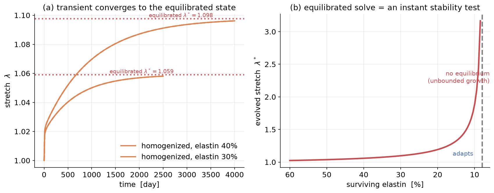

# 6. The equilibrated constrained mixture model

*Latorre & Humphrey (2018). Code:
[`gr/equilibrated_cmm.py`](../src/gr/equilibrated_cmm.py).*

---

## 6.1 The idea: skip the transient

Often you do not care *how* the tissue gets to its adapted state — only *what*
that state is. The equilibrated model sets every rate to zero and solves the
resulting **algebraic** system directly: one root-find instead of thousands of
time steps.

## 6.2 Equilibrium conditions

At mechanobiological equilibrium:

- **(A) Growth balance** — production balances removal, $\Upsilon=1$, so the
  tissue stress returns to homeostatic: $\ \bar\sigma^\ast = \bar\sigma_h$.
- **(B) Remodeling done** — every turnover constituent sits at its deposition
  stretch: $\ \lambda_e^k = G^k \Rightarrow \sigma^k = \sigma_h^k$.
- **(C) Mechanical equilibrium** holds at the evolved geometry (Laplace).

Elastin cannot remodel or be produced, so its mass is just the surviving fraction
$s$ and its stress follows the evolved stretch, $\sigma_e(G_e\lambda^\ast)$.

## 6.3 Collapse to one scalar equation

Let the turnover constituents grow in fixed proportion by a factor $\beta$ (exact
when they share gain and turnover, as here). Conditions (A)–(C) reduce to a
**single** equation for the evolved stretch $\lambda^\ast$ (derivation in the code
docstring):

$$\phi_{e0}s +
  s\frac{\bar\sigma_h - \sigma_e(G_e\lambda^\ast)}{\sigma_{\text{turn}} - \sigma_h^e} -
  \gamma(\lambda^\ast)^{2} = 0,\qquad (6.1)$$

with the Laplace exponent $n=2$ for the artery, $\gamma$ the sustained load
factor, $s$ the surviving elastin fraction, $\phi_{e0}$ the reference elastin
fraction, $\sigma_{\text{turn}}$ the mass-weighted homeostatic stress of the
turnover constituents, and $\sigma_h^e$ the homeostatic elastin stress. Once
$\lambda^\ast$ is known, the evolved mass ratio is $M/M_0 = \gamma(\lambda^\ast)^n$.

Because (6.1) is nothing but the fixed point of the homogenized ODEs, the
equilibrated solution **coincides with the long-time limit of the transient
theories** — to several digits (see the flat red target lines in the §5 figure,
which the black and dashed curves settle onto).

## 6.4 The punchline: existence = stability

Equation (6.1) may have **no physical root**. Then there is no adapted state to
converge to, and the transient theories dilate without bound. So the equilibrated
solver is also the cleanest possible **stability test**: solve one algebraic
equation; if it has a root the tissue adapts, if it does not the tissue is
mechanobiologically unstable.

<i>(a) The homogenized transient settles exactly onto the equilibrated stretch
$\lambda^\ast$ (dotted) — the two theories agree whenever an equilibrium exists.
(b) The evolved stretch from the instant equilibrated solve, swept over insult
severity: it rises steeply and then, past a critical elastin loss, the
equilibrium simply ceases to exist — the onset of unbounded growth. No time
integration was needed to find that boundary.</i>

Notice in (a) that the closer the insult pushes the tissue toward the existence
boundary, the *longer* the transient takes to converge (**critical slowing
down**). Near the boundary the transient is impractically slow — which is exactly
why the instant equilibrated test is so useful.

---

### Exercise → [`exercises/ex05_equilibrated.py`](../exercises/ex05_equilibrated.py)

Sweep the insult and find, from the equilibrated solve alone, the critical
elastin loss at which the artery can no longer adapt. Then confirm with a
transient run that it indeed runs away just past that point.
