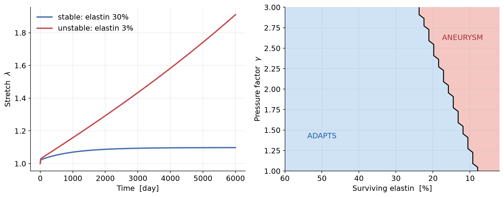

# 7. Capstone — stability: adaptation vs. aneurysm

*Code: [`gr/stability.py`](../src/gr/stability.py). This ties the whole lecture
together.*

---

## 7.1 The question, restated precisely

A tissue is **mechanobiologically stable** if, after a sustained insult, it
settles at a new bounded equilibrium. It is **unstable** if it grows without
bound. The central result of the modern G&R literature — and of this course — is
that **stability depends on the insult** (and on the tissue's gain and
stiffness), and can be *predicted*.

## 7.2 Where instability comes from: the Laplace exponent

Recall the required-stress law ([§2](02_finite_strain.md),
[`gr/geometry.py`](../src/gr/geometry.py)):

$$\text{artery (Laplace):}\quad \sigma_{\text{req}} \propto \frac{\lambda^2}{M/M_0}.$$

Growth adds mass ($M\uparrow$), which lowers the required stress — a **stabilising
negative feedback**. But dilation ($\lambda\uparrow$) *raises* the required
stress, and in the artery it does so quadratically (Laplace). When elastin — the
tissue's low-stretch load-bearing buffer — is lost, dilation wins the race
against mass production, and the feedback turns positive: **runaway**. It is the
quadratic Laplace exponent that makes this race losable at all.

## 7.3 Two ways to read stability

**(1) Existence of an equilibrium (instant).** From [§6](06_equilibrated_cmm.md),
the equilibrated equation (6.1) has a root iff the tissue can adapt. Sweeping the
insult traces the stable/unstable boundary with no time integration
([`gr.stability.adapts`](../src/gr/stability.py)).

**(2) Watching the transient.** Integrate the homogenized (or full) model: a
stable insult plateaus, an unstable one climbs without bound. Near the boundary
the transient slows down dramatically (critical slowing) — so (1) is the
practical tool and (2) is the confirmation.

*(a) The same tissue, two insults: retaining 30% of elastin, it adapts and
plateaus (blue); retaining only 3%, it dilates without bound (red). (b) The
stable/unstable map over the (surviving-elastin, pressure) plane, computed purely
from the equilibrated existence test. Mild insults live in the blue "adapts"
region; severe ones cross into the red "aneurysm" region.*

## 7.4 How the four theories answer

| Theory | Can it predict stability? | What it says |
|---|---|---|
| Kinematic growth | No — stability is *imposed* | Reaches the prescribed set-point, or runs away; you don't learn *why* from turnover. |
| Full CMM | Yes | Adapts or dilates depending on insult; the faithful reference. |
| Homogenized CMM | Yes | Same verdict as the full model, cheaply. |
| Equilibrated CMM | Yes — *instantly* | A root exists ⇔ the tissue adapts. No root ⇔ unbounded growth. |

## 7.5 The takeaways of the whole lecture

1. **Kinematic growth** imposes a homeostatic target; it is simple and robust but
   cannot predict mechanobiological (in)stability.
2. **Constrained mixtures** predict stability from tissue turnover, and it
   **depends on the insult**.
3. The **homogenized** model reproduces the full model's trajectory at a fraction
   of the cost.
4. The **equilibrated** model matches the transient theories *when an equilibrium
   exists*, and — by failing to find one — flags exactly when the tissue becomes
   unstable.

---

### Exercise → [`exercises/ex05_stability_and_aneurysm.py`](../exercises/ex05_stability_and_aneurysm.py)

Reproduce the stability map, then explore what stabilises a tissue: raise the
production gain, stiffen the collagen, or increase the deposition stretch, and
watch the "aneurysm" region shrink.
